# Mapa de contenido
El Mapa de Contenido te ayudará indicándote a qué capítulos y dashboards puedes dirigirte según el objetivo del análisis que desees hacer en función de la dimensión.

Outline

* [Producto](#producto)
* [Tienda](#tienda)
* [Marca](#marca)
* [Categoría / Subcategoría](#categoria)

***

## Producto

[volver al outline](#outline)

***

## Tienda

[volver al outline](#outline)

***

## Marca

[volver al outline](#outline)

***

## Categoría / Subcategoría

[volver al outline](#outline)